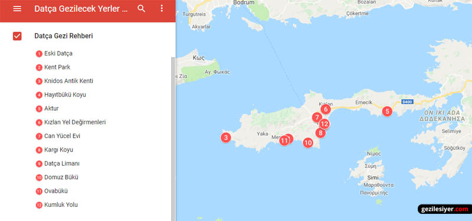
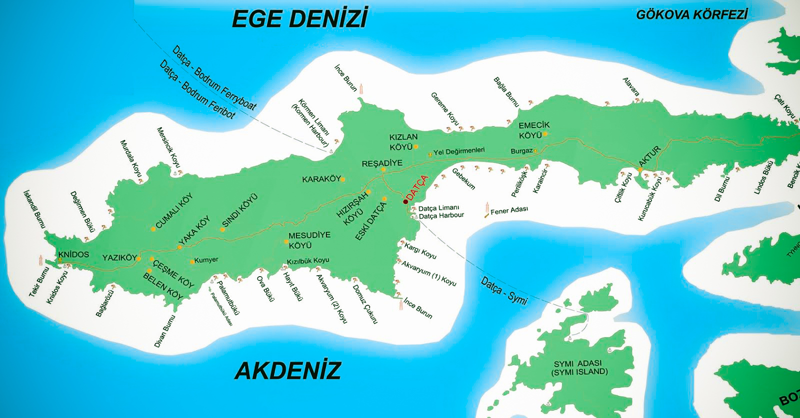
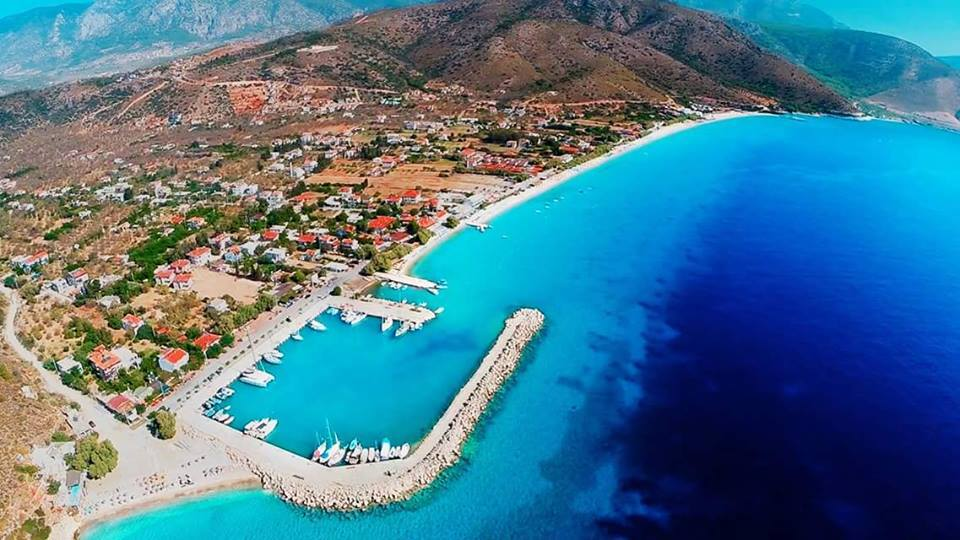
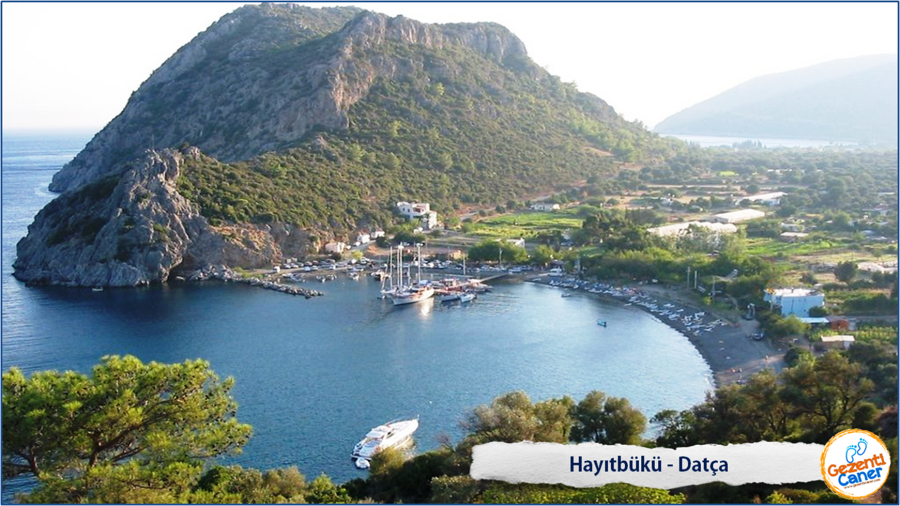
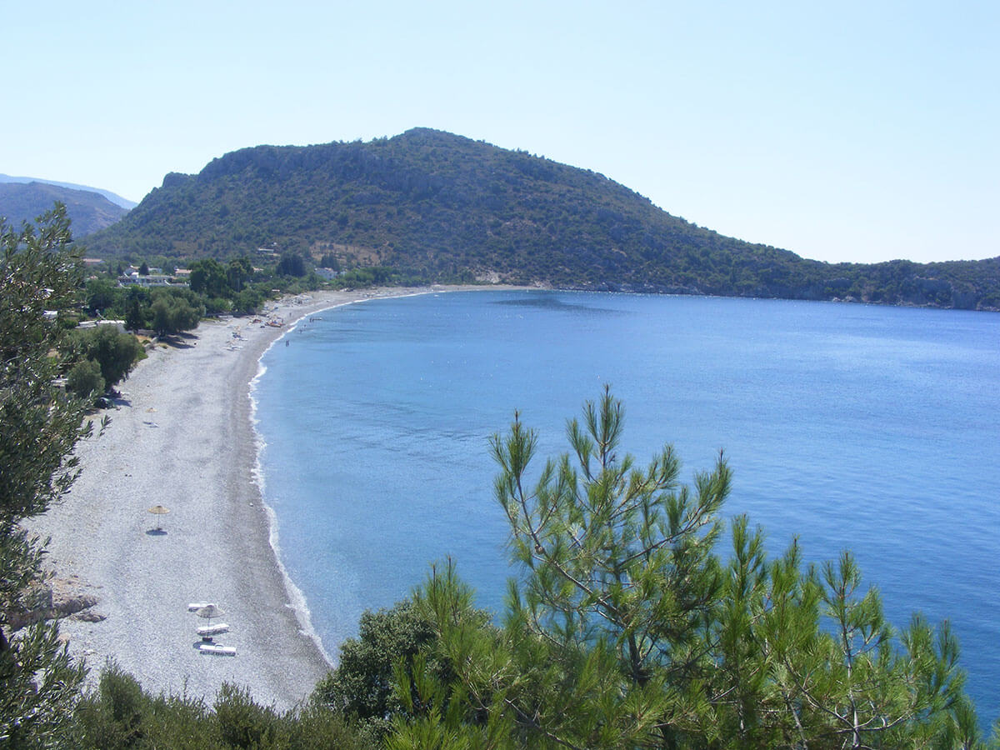
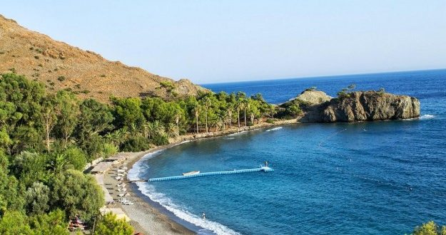
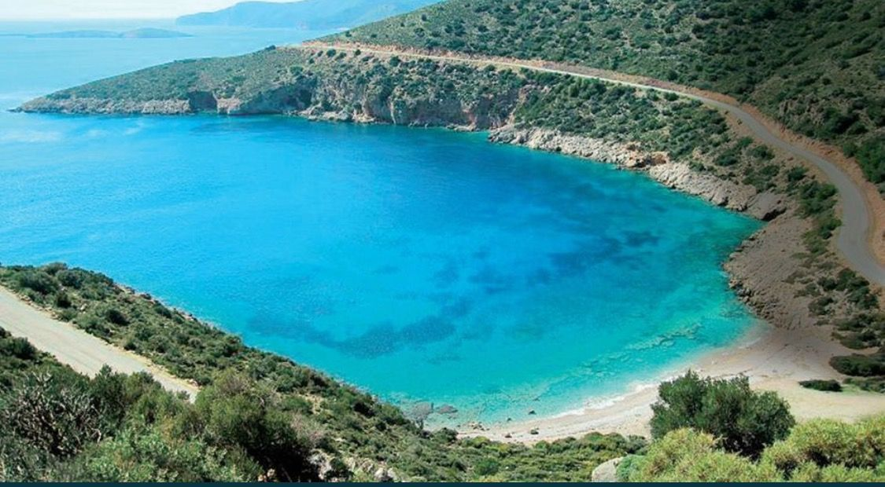
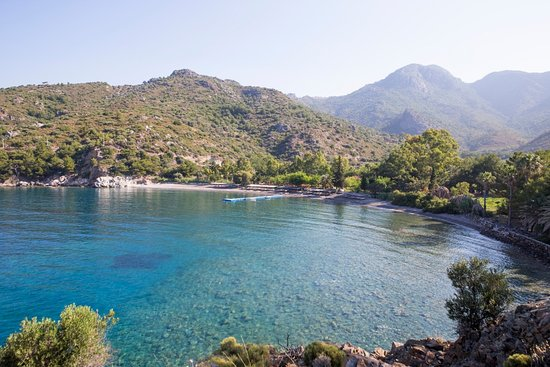
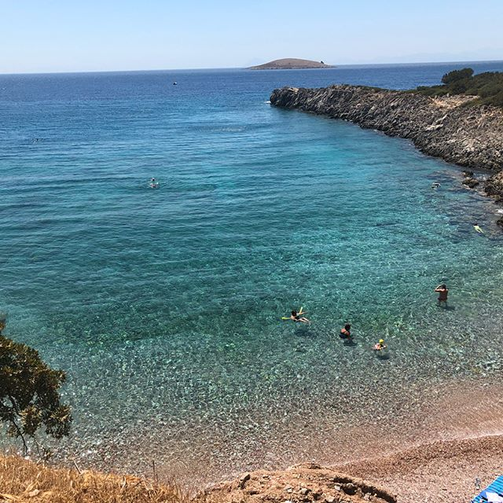

# Datca101

## Haritamsi

## Faydali Linkler

- [Koylar](http://nereyekacsak.com/datcanin-arabayla-gidilebilen-en-guzel-7-koyu/) 

- [Yemek 1](https://yemek.com/datca-mekanlari-nerede-yenir/)

- [Yemek 2](https://www.nefisyemektarifleri.com/blog/datcada-ne-yenir-mutlaka-gitmeniz-gereken-10-meshur-mekan/)

## Deniz'in favorileri

- __Palamutbuku (24.3 km)__ : Burasi iclerinde en cok gittigim deniz'in rengini en cok sevdigim yer. Sahilde mekanlar olur, mitili atar cay kahve birani icer; sana verdikleri sezlongda guneslenir denize girersin. Eger f/p takilacaksak sahile dik inen yoldan saga donup ilerde marketten once __`PAYAM`__ denen mekanda butun gun takilinir. Kahvaltisi, cayi ve ozellikle kahvesi guzeldir. Papaganlari seversiniz. Yemekleri iyidir. Makarna/manti urunlerinde porsiyon kucuktur. Menu'de basinda Payam yazan spesyallerden soylerseniz hem doyarsiniz hem de kaziklanmis hissetmezsiniz. Sahibi kir sacli, uzun, iri/yari adama Dr. Gunduz'den selam soylersiniz. Garsonlar cogunlukla ogrenci cocuklardir. Son ise giren bir elektronik muhendisi var Karabuk'te bu sene baslayacak. Biraz daha luks takilalim derseniz saga degil sola donup yolun bitiminde __`Mavi_Beyaz`__ denen bir otelin sezlonglarinda takilabilirsiniz. Datca'yi yasamak icin ilk mekan cok daha guzel. 

- __Hayitbuku(18.1 km)__: Burasi herkesin bildigi, popi bir yer (yine Datca popiliginde Bodrum gibi degil). Biz balayinda uc gun burada ahsap evlerde kalacagiz. Ve yine sizin gibi buraya yazdigim koylari gezecegiz. Burada mekanlarin cok farki oldugunu sanmiyorum. Gozunuze kestirdiginiz bir isletmede takilabilirsiniz, sarmadiysa hic bir mekan 10 km daha batiya gidip Palamutbuku yapabilirsiniz (ya da listeden baska bir buk secelim). Palamutbukune zaafim oldugu dogrudur.

- __Ovabuku(18.3 km)__ : Burasi Mesudiye koyunun altinda, Hayit ile Palamut arasinda. Mutevazi bir yer. Sezlong semsiye yine isletmeye ait.

- __Kargi(6.9 km)__: Burasi da bizzat gittigim (son bayramda) yerlerden. Palamutbukunden sonra cok acmayabilir. Fakat Datca'ya en yakin en guzel deniz burada. Ilk duraginiz burasi olmasi muhtemel olabilir. Palamutbuku gibi iki farkli mekan var onerecegim. Birincisi benim gittigim __`Kargilos`__ diye bir yer. __`Payam`__ ile isleyis mantigi ayni. Hemen yaninda da bir otel var. Datcali tanidiklarimiz geceligi 1500 lira olmasina ragmen full cektigini soylediler. Yine daha luks/garanti (parayi veririm kaliteli hizmet alirim) olmasini isterseniz o otelin sahilinde takilabilirsiniz. __`Kargilos`__'ta cok aman neden diger yere gitmedik dedirtecek bir pismanlik yasamazsiniz diye dusunuyorum. 

### Honorable Mentions 

- __Kurubuk(20.4 km)__: Sezlong/semsiye yok

- __Kizilbuk(19 km)__ : Tek mekan ahsap evler

- __Domuzbuku(Merkezden sadece tekne ile bence denenebilir. Ben de gidecegim bu sefer)__

## Yemek/icmek

- Prensip geregi mekan onermiyorum, sonradan patlak verebiliyor. Gidilecek yerlerde hint verdigim icin orada birine sorsaniz bile burada yeme surada ye derler ya da linklere tiklanabilir yukarda. Or just ask google.cia INC.

- Biz yazin gittigimizde `AV MEVSIMI` oldugunu bildigimiz icin cok yanasmiyoruz aksam raki/balik faslina. 

- Datca Merkez icin Deniz urunleri disinda bir sey yemek isterseniz; `Zekeriya Ev yemekleri` ve `Kardesler Pide`'yi kesinlikle oneririm.

- Yine havalimani==> Datca ya da Datca==>Dugun guzergahinda [Mavi Pide](https://goo.gl/maps/92VpJktA9st7P1T88) iyidir (selimiye yol ayrimindan once/sonra).

### Kahvalti

- Otel'deki kahvaltiyi es gectiyseniz gittiginiz buklerde cok rahat guzel urunlerle kahvalti edebilirsiniz. Palamutbuku disinda serpme soylerken kisi sayisina dikkat edin bazen cok fazla sey geliyor (2 kisilik soyleseniz bile).

### Gunicerisinde herhangi bir ogun

- Deniz mahsulu ara sicaklari olabilir, meze olabilir

- Palamutbuku Payam'da firin da var surekli sicak guzel seyler cikiyor.

- Pattes/bira, Kofte/pattes, pasta, manti akabilir. 

### Aksam

- Datca'da deniz urunleri disinda super guzel olan bir urun maalesef yok.

- F/P takilacaksak raki/balik sadece bir gece yapilabilir, diger tum case'lerde meze ve ara_sicaga (kalamar,ahtapot,karides 40 ila 55 lira'dan fazlaysa kufur edin cikin) abanarak keyifli doyarsiniz. 

## Gezelim/Gormeyelim

- Eski Datca

- Knidos

- Can Yucel'in evi (iceri girmeyin esi hala orada yasiyor xD)